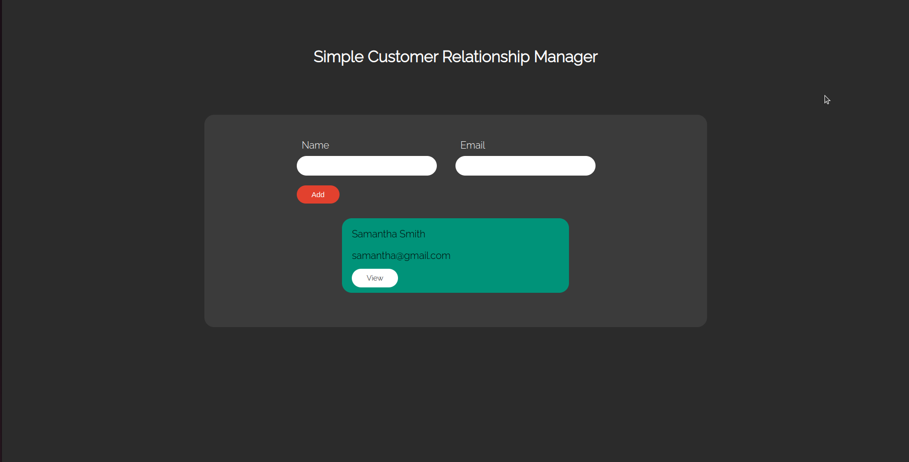

# Simple Customer Relationship Manager



## A full-stack project built using HTML, CSS, JavaScript, React, Node.js, MongoDB with E2E tests using Jest and Puppeteer.

## How To Run Locally

### Setup back-end

In api/ run:

```bash
npm i
```

Then run a mongodb server (with no username/password) at:

```bash
"mongodb://localhost:27017/crm"
```

Then in api/ start node server:

```bash
node index.js
```

### Setup front-end

In client/ run:

```bash
npm i
```

Then start react server:

```bash
npm start
```

## How To Run E2E Tests

In client/ run:

```bash
npm run test:e2e
```
